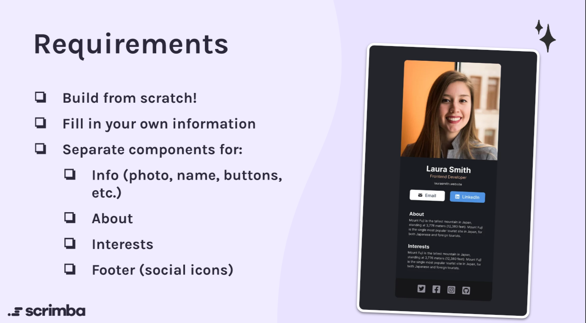

<h1 align="center">Frontend Developer Card</h1>
<p align="center">
  Made with <code>HTML</code>, <code>CSS</code>, <code>JavaScript</code>, <code>ReactJS</code>, <code>styled-components</code>
</p>
<p align="center">
  Built with <code>Vite</code>
</p>

<p align="center">
  
</p>

## ℹ️ About

This is a solution to the Scrimba React Course [challenge #1](https://scrimba.com/learn/learnreact/react-section-1-solo-project-coce646e88eea46f91af43ca4).

The challenge is to build out a 3 Column Preview Card and get it looking as close to the design as possible.

<p align="center">
  
</p>

Figma prototype: https://www.figma.com/file/4ctPLUvIn5b5Ep6YPOZWWd/Digital-Business-Card

## ⚙️ Tools

- **HTML5**
  - Semantic HTML
- **CSS**
  - Styled Components
- **JavaScript**
  - ReactJS
- **NodeJS**
- **Vite**
- **Github Pages**

## 🔨 Build project

<table>
  <tr>
    <th>Command</th>
    <th>Description</th>
  </tr>
  <tr>
    <td><code>npm&nbsp;install</code></td>
    <td>Installs required npm packages. Run it before building the project</td>
  </tr>
  <tr>
    <td><code>npm&nbsp;run&nbsp;dev</code></td>
    <td>Ыtarts a local web server with HMR (Hot Module Replacement) for development</td>
  </tr>
  <tr>
    <td><code>npm&nbsp;run&nbsp;build</code></td>
    <td>Иuilds the project, and outputs to the folder <code>./build</code></td>
  </tr>
  <tr>
    <td><code>npm&nbsp;run&nbsp;preview</code></td>
    <td>Start a local web server that serves the built solution from <code>./build</code> for previewing</td>
  </tr>
</table>

## 📁 File Structure

<table>
  <tr>
    <th>Path</th>
    <th>Description</th>
  </tr>
  <tr>
    <td colspan="2"></td>
  </tr>
  <tr>
    <td><code>build</code></td>
    <td>Folder with files generated by Vite</td>
  </tr>
  <tr>
    <td><code>static</code></td>
    <td>Folder with static assets (images, favicon)</td>
  </tr>
  <tr>
    <td colspan="2"></td>
  </tr>
  <tr>
    <td><code>src</code></td>
    <td>Source files needed for application development</td>
  </tr>
  <tr>
    <td><code>src / components</code></td>
    <td>Folder with React components</td>
  </tr>
  <tr>
    <td><code>src / styles</code></td>
    <td>Folder with global styles written in styled components</td>
  </tr>
  <tr>
    <td><code>src / App.jsx</code></td>
    <td>Main code for the application</td>
  </tr>
  <tr>
    <td><code>src / index.jsx</code></td>
    <td>Entry point for the module bundler</td>
  </tr>
  <tr>
    <td><code>src / index.html</code></td>
    <td>Main html file</td>
  </tr>
  <tr>
    <td colspan="2"></td>
  </tr>
  <tr>
    <td><code>docs</code></td>
    <td>Folder with additional information, documentation</td>
  </tr>
  <tr>
    <td><code>docs / results</code></td>
    <td>Folder with screenshots of how the application works after being fully developed</td>
  </tr>
  <tr>
    <td><code>docs / requirements.png</code></td>
    <td>What must be done in this challenge</td>
  </tr>
  <tr>
    <td colspan="2"></td>
  </tr>
  <tr>
    <td><code>LICENSE</code></td>
    <td>MIT License</td>
  </tr>
  <tr>
    <td><code>package-lock.json</code></td>
    <td>JSON file that keeps track of the exact version of every package that is installed so that a product is 100% reproducible in the same way even if packages are updated by their maintainers</td>
  </tr>
  <tr>
    <td><code>package.json</code></td>
    <td>JSON file that holds various metadata relevant to the project. This file is used to give information to npm that allows it to identify the project as well as handle the project's dependencies</td>
  </tr>
  <tr>
    <td><code>vite.common.js</code></td>
    <td>Configuration for Vite module bundler</td>
  </tr>
  
</table>

## 💡 Details

### First time working with Vite

Quickly bundles files into results. Looks like everything works out of box, didn't have to configure much. Installation time was extremely quick. In under 10 secs it installed all packages. For comparison it required several minutes to install packages for create-react-app.

Although in Webpack I had much more control over how things are done under the hood.

To put in short, it just works fine out of box and requires almost zero configuring. And works really fast

<hr>

### First time working with ReactJS

I really like this component approach, it makes the code look nice and clean.

Although such a simple task turned into 10 components! The prototype doesn't even have that many details. Looks like I'm doing something a little bit wrong here.

At least I practiced to divide an interface into separate components

Look how neat it looks

```jsx
export default function App() {
  return (
    <ThemeProvider theme={theme}>
      <GlobalStyle />
      <Card>
        <Photo />
        <InfoContainer>
          <Info />
          <Article type="about" />
          <Article type="interests" />
        </InfoContainer>
        <Footer />
      </Card>
    </ThemeProvider>
  );
}
```

<hr>

### First time working with Styled Components

It required some time to understand how it works. I just create a styled component, then write a main component that returns that styled component
Like this:

```jsx
import styled from "styled-components";
import IconLink from "./IconLink";

const StyledFooter = styled.footer`
  display: flex;
  align-items: center;
  justify-content: center;
  gap: 16px;
  background: ${({ theme }) => theme.colors.footerBackground};
  padding: 20px;
`;

export default function Footer() {
  return (
    <StyledFooter>
      <IconLink type="twitter" />
      <IconLink type="facebook" />
      <IconLink type="instagram" />
      <IconLink type="github" />
    </StyledFooter>
  );
}
```

Overall I enjoyed working with styles using Styled Components. HTML, JS and CSS in one place. No need to constantly switch between html, css and js files.

- Used createGlobalStyle for global styles
- Used ThemeProvider to store all colors in one place and refer them from components

## 🔗 Useful resources

- [ReactJS Course](https://scrimba.com/learn/learnreact/) - Awesome free interactive course!
- [Styled Components Crash Course & Project](https://www.youtube.com/watch?v=02zO0hZmwnw&t=738s&ab_channel=TraversyMedia) - Great tutorial explaining how to work with styled-components
- [Vite docs](https://vitejs.dev/)

## 👤 Author

- Frontend Mentor - [@GrbnvAlex](https://www.frontendmentor.io/profile/GrbnvAlex)
- Telegram - [@Arlagonix](https://t.me/Arlagonix)
- Github - [@arlagonix](https://github.com/arlagonix)
