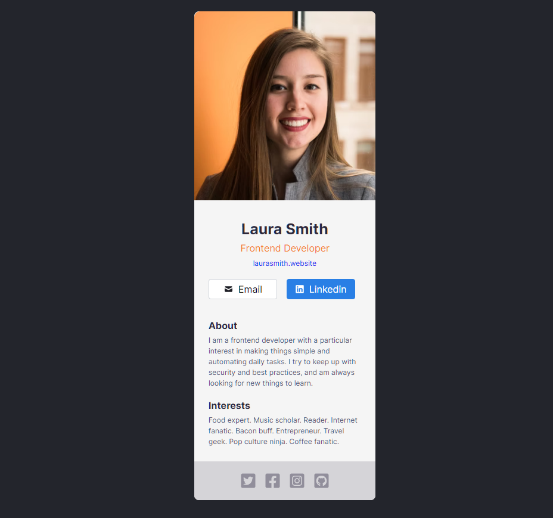

<h1 align="center">Frontend Developer Card</h1>
<p align="center">
  Made with <code>HTML</code>, <code>CSS</code>, <code>JavaScript</code>, <code>ReactJS</code>, <code>styled-components</code>
  <br>
  Bootstrapped with <code>Vite</code>
</p>

<p align="center">
  <a href="../../commits"></a>
  <a href="./LICENSE"></a>
  
</p>

<p align="center">
  <a href="#-screenshots">🖼 Screenshots</a> • 
  <a href="#ℹ%EF%B8%8F-about">ℹ️ About</a> • 
  <a href="#%EF%B8%8F-tools">⚙️ Tools</a> • 
  <a href="#-build-project">🔨 How to Build Project</a> • 
  <a href="#-file-structure">📁 File Structure</a>
</p>

<sup>
  <p align="center">
    <a href="#-details">💡 Details</a> • 
    <a href="#-useful-resources">🔗 Useful resources</a> • 
    <a href="#-author">👤 Author</a>
  </p>
</sup>

## 🖼 Screenshots

<p align="center">
  
</p>

## ℹ️ About

This is a solution to the Scrimba React Course [challenge #1](https://scrimba.com/learn/learnreact/react-section-1-solo-project-coce646e88eea46f91af43ca4).

The challenge is to build out a Frontend Developer Card and get it looking as close to the design as possible.

<p align="center">
  
</p>

Figma prototype: https://www.figma.com/file/4ctPLUvIn5b5Ep6YPOZWWd/Digital-Business-Card

## ⚙️ Tools

- **HTML5**
  - Semantic HTML
- **CSS**
  - Styled Components
- **JavaScript**
  - ReactJS
- **NodeJS**
- **Vite**
- **Github Pages**

## 🔨 Build project

<table>
  <tr>
    <th>Command</th>
    <th>Description</th>
  </tr>
  <tr>
    <td><code>npm&nbsp;install</code></td>
    <td>Installs required npm packages. Run it before building the project</td>
  </tr>
  <tr>
    <td><code>npm&nbsp;run&nbsp;dev</code></td>
    <td>Starts a local web server with HMR (Hot Module Replacement) for development</td>
  </tr>
  <tr>
    <td><code>npm&nbsp;run&nbsp;build</code></td>
    <td>Builds the project, and outputs to the folder <code>./build</code></td>
  </tr>
  <tr>
    <td><code>npm&nbsp;run&nbsp;preview</code></td>
    <td>Start a local web server that serves the built solution from <code>./build</code> for previewing</td>
  </tr>
</table>

## 📁 File Structure

```Markdown
├── 📁 build                  Files of the build solution
|
├── 📁 docs                   Additional information, documentation 
│   └── 📁 results            Screenshots of how the application works after being fully developed
|
├── 📁 src                            Source files needed for application development
│   ├── 📁 components                 React components
|   |   └── 📁 Component Name
|   |       ├── 📝 index.jsx          Component logic
|   |       └── 📝 index.styled.jsx   Component styles
│   ├── 📁 styles                     Global styles
│   ├── 📝 App.jsx                    App React component
│   ├── 📝 index.html                 Main html file
│   └── 📝 index.jsx                  Entry point for the module bundler
|
├── 📁 static                 Static assets: images, icons, favicons
|
├── 📝 .gitignore             Instructions for Git about what files to ignore
├── 📝 LICENSE                MIT License. Basically you can do whatever you want with the code
├── 📝 README.md
├── 📝 package-lock.json      Keeps track of the exact version of every package that is installed
├── 📝 package.json           Various metadata relevant to the project, scripts, dependencies
└── 📝 vite.config.ts         Vite configuration file
```

## 💡 Details

### First time working with Vite

Quickly bundles files into results. Looks like everything works out of box, didn't have to configure much. Installation time was extremely quick. In under 10 secs it installed all packages. For comparison it required several minutes to install packages for create-react-app.

Although in Webpack I had much more control over how things are done under the hood.

To put in short, it just works fine out of box and requires almost zero configuring. And works really fast

<hr>

### First time working with ReactJS

I really like this component approach, it makes the code look nice and clean.

Although such a simple task turned into 10 components! The prototype doesn't even have that many details. Looks like I'm doing something a little bit wrong here.

At least I practiced to divide an interface into separate components

Look how neat it looks

```jsx
export default function App() {
  return (
    <ThemeProvider theme={theme}>
      <GlobalStyle />
      <Card />
    </ThemeProvider>
  );
}
```

<hr>

### First time working with Styled Components

It required some time to understand how it works. I just create a styled component, then write a main component that returns that styled component

Overall I enjoyed working with styles using Styled Components. HTML, JS and CSS in one place. No need to constantly switch between html, css and js files.

- Used createGlobalStyle for global styles
- Used ThemeProvider to store all colors in one place and refer them from components

## 🔗 Useful resources

- [ReactJS Course](https://scrimba.com/learn/learnreact/) - Awesome free interactive course!
- [Styled Components Crash Course & Project](https://www.youtube.com/watch?v=02zO0hZmwnw&t=738s&ab_channel=TraversyMedia) - Great tutorial explaining how to work with styled-components
- [Vite docs](https://vitejs.dev/)

## 👤 Author

- Frontend Mentor - [@GrbnvAlex](https://www.frontendmentor.io/profile/GrbnvAlex)
- Telegram - [@Arlagonix](https://t.me/Arlagonix)
- Github - [@arlagonix](https://github.com/arlagonix)
